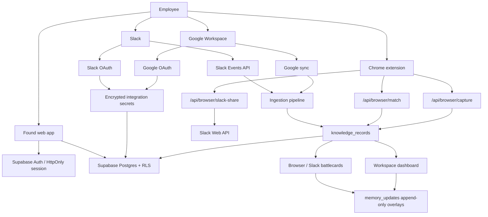

# Found — developer handoff

Last updated: 18 July 2026

This is the practical handoff for the next developer taking over Found. It captures what the product is meant to be, what has already been built, the important user-learning from this build, the current architecture, the known fragile areas, and the recommended order of work.

## 1. Product in one sentence

Found is a source-backed organisational-memory platform that watches where teams already work, detects when a new idea duplicates or conflicts with prior company knowledge, and surfaces a calm, permission-aware battlecard with receipts.

The product is not meant to be a generic search engine, chatbot, or demo dashboard. The core promise is:

> “Before the team repeats work, Found shows what was already tried, decided, measured, built, or rejected — with links back to the original source.”

## 2. Current live project

- Production URL: `https://sage-profiterole-3b1c22.netlify.app`
- Main workspace: `https://sage-profiterole-3b1c22.netlify.app/workspace`
- Integrations page: `https://sage-profiterole-3b1c22.netlify.app/integrations`
- Source repository: `https://github.com/Pratiksha935/Echo`
- Hosting: Netlify connected to `main`
- Current handoff worktree: `.codex-worktrees/hermes-rework`
- Primary stack: Next.js App Router, React 19, TypeScript, Supabase/Postgres, Netlify, Slack OAuth/Events/Interactivity, Google OAuth/Drive APIs, Chrome Manifest V3 extension.

## 3. What the founder/user is trying to build

The intended product direction is bigger than the seed demo. Found should become the central company-memory layer for founders, executives, product teams, sales teams, GTM teams, and engineering teams.

The repeated instructions and learning from testing were:

- Build for real company workspaces, not a hardcoded demo.
- The user should connect Google Workspace and Slack, then see their own indexed company memory.
- Source systems remain authoritative. Found stores indexed records, source URLs, permissions, summaries, and append-only updates.
- Found must feel enterprise-grade: calm, trustworthy, source-backed, permission-aware, and low-noise.
- The dashboard should answer “what does the company know right now?” rather than dumping rows.
- The browser extension should be useful on ordinary web pages, Google Docs, Google Sheets, and Slack web.
- Slack desktop requires native Slack App surfaces because a Chrome extension cannot run inside the Slack desktop app.
- Battlecards should appear automatically only for strong matches. No strong match should mean silence plus an option to save the current page.
- False positives are worse than missed weak matches.
- Do not expose model/tool errors, stack traces, gateway errors, or infrastructure failures in Slack or end-user surfaces.

## 4. Main user flows

### A. Workspace onboarding

1. User signs in.
2. User lands in Found workspace.
3. User connects Google Workspace and Slack from `/integrations`.
4. Found stores the integration connection and encrypted provider credential.
5. Ingestion pulls source-backed records into `knowledge_records`.
6. Dashboard shows company memory, trends, updates, and source receipts.

Important distinction: logging in with Google is not the same as authorising Drive/Docs ingestion. Integration consent must be explicit.

### B. Browser extension match flow

1. User installs and pairs the Chrome extension.
2. Extension reads the current page title, URL, and bounded visible text.
3. Extension calls `/api/browser/match`.
4. Server checks the paired browser token and workspace membership.
5. Server loads candidate `knowledge_records` for that organisation.
6. Matcher returns a battlecard only if the evidence is strong enough.
7. If a strong match exists, the battlecard opens automatically.
8. If no strong match exists, the small avatar remains available but the UI stays quiet.

Desired UX rule: the extension should be “ambient until useful.”

### C. Browser save flow

1. User clicks the avatar when no match is shown, or when they want to save the page.
2. User chooses department and adds a note.
3. Extension posts to `/api/browser/capture`.
4. Server creates a `knowledge_records` row with `source = "Browser"`.
5. Server returns `/workspace` as the destination.
6. Dashboard should show the saved memory in the right department/timeline.

Important current fix in this handoff branch: saved browser records now redirect to `/workspace` instead of a fragile detail URL such as `/workspace/decision/browser:<uuid>`.

### D. Slack native flow

Slack must stay low-noise.

Intended surfaces:

- message shortcut: “Check with Found”
- private modal battlecard
- App Home with recent detections, saved links, memory review, and setup status
- optional explicit share action when the user chooses to post something publicly

Routine scans should not publicly reply in channels.

### E. Slack web extension flow

The Chrome extension can inspect Slack web, but it must be careful:

- inspect only the newest visible human message;
- ignore Slack UI chrome, date separators, “view thread,” notification banners, and composer text;
- do not scan Found’s own injected overlay;
- do not create battlecard loops after a user is redirected from Found to Slack.

## 5. Current implementation map

### Product pages

- `app/page.tsx` — public landing page.
- `app/login/page.tsx` — login UI.
- `app/workspace/page.tsx` and `app/workspace/workspace-dashboard.tsx` — authenticated workspace dashboard.
- `app/workspace/decision/[recordId]/page.tsx` — decision-detail route. Unknown or fragile browser IDs should redirect safely rather than hard-404.
- `app/integrations/page.tsx` and `app/integrations/integration-setup.tsx` — integration control plane.
- `app/browser/connect/page.tsx` and `app/browser/authorize/page.tsx` — browser-extension pairing.
- `app/code-review/page.tsx` — code prior-art review surface.
- `app/memory/correct/page.tsx` — memory correction/update surface.

### Browser extension

- `extension/manifest.json` — Chrome MV3 manifest.
- `extension/background.js` — background worker and extension state.
- `extension/content.js` — in-page avatar, scan, battlecard, save/share UI.
- `extension/content.css` and `extension/update.css` — injected UI styles.
- `extension/popup.html`, `extension/popup.css`, `extension/popup.js` — popup/pairing helper.
- `extension/README.md` — installation notes.

### Browser APIs

- `app/api/browser/session/route.ts` — extension session/pairing support.
- `app/api/browser/match/route.ts` — returns battlecard match for the current page.
- `app/api/browser/capture/route.ts` — saves a page into memory.
- `app/api/browser/memory-update/route.ts` — appends user feedback/update from browser.
- `app/api/browser/slack-targets/route.ts` — loads possible Slack share destinations.
- `app/api/browser/slack-share/route.ts` — shares selected page/context to Slack.
- `lib/browser/matcher.js` — current deterministic browser matcher.

### Auth and workspace access

- `lib/auth/session.ts` — user session helpers.
- `lib/auth/browser-token.ts` — paired browser token signing/verification.
- `lib/auth/workspace.ts` — workspace and record loading helpers.
- `lib/auth/config.ts`, `lib/auth/origin.ts` — auth and origin configuration.
- `app/auth/*` — login, callback, refresh, logout, demo/password flows.

### Integrations and ingestion

- `lib/integrations/catalog.ts` — provider catalogue/readiness metadata.
- `lib/integrations/oauth.ts` — OAuth helpers.
- `lib/integrations/secrets.ts` and `lib/integrations/credentials.ts` — encryption/credential envelope handling.
- `lib/integrations/store.ts` — connection storage.
- `lib/integrations/service-rest.ts` — Supabase service REST helper.
- `lib/integrations/google-sync.ts` — Google ingestion.
- `lib/integrations/slack-events.ts` — Slack event classification/ingestion helpers.
- `app/api/slack/events/route.ts` — Slack Events endpoint.
- `app/api/slack/interactions/route.ts` — Slack interactivity endpoint.
- `app/api/internal/ingestion/run/route.ts` — internal ingestion runner.

### Data and memory

- `supabase/migrations/*.sql` — production Supabase schema and RLS.
- `db/schema.ts` — Drizzle/D1 schema used by the earlier Sites build.
- `lib/workspace/intelligence.ts` — transforms records and updates into dashboard decision memory.
- `data/*.json` — fictional ReLoop seed/evaluation data for the demo and regression checks.

## 6. Current architecture



## 7. Data model concepts

Production Supabase migrations are the source to inspect first. Conceptually:

- `organisations` — tenant/workspace.
- `memberships` — users in an organisation.
- `integration_connections` — OAuth connection per organisation/provider.
- `integration_secrets` — encrypted credential material, service-role access only.
- `knowledge_records` — indexed source-backed memory items.
- `memory_updates` — append-only user/team updates layered on top of source truth.
- `ingestion_events` — durable event queue for Slack/connector ingestion.
- `integration_sync_runs` or sync-run equivalent — sync status/audit trail.

Rules:

- `knowledge_records` must keep `source_url`.
- `memory_updates` must never overwrite source records.
- Retrieval must filter by organisation and effective permissions before ranking.
- Restricted/private source visibility must map to source principals before display.

## 8. Behaviour contract

### Closed-world answers

Found should answer only from indexed company knowledge. If evidence is insufficient, the answer should say that there is not enough company evidence. It should not fill gaps with generic advice.

### Matching threshold

Show a battlecard only for:

- exact same intervention and outcome; or
- same underlying intervention expressed differently.

Do not show a battlecard for:

- tangentially related work;
- broad keyword overlap;
- generic AI/company/research pages;
- shopping/catalogue queries;
- casual Slack conversation;
- UI text extracted from Slack/web chrome;
- Found’s own injected overlay text.

Known negative controls from testing:

- Harness Engineering article must not match a rental deposit decision unless the indexed company knowledge is actually about developer portals/scorecards.
- Anthropic homepage/research pages must not match rental deposit decisions.
- “Let’s go for lunch” should produce no Slack response.
- “red saree under ₹2,000” is a catalogue query and should stay silent.
- “virtual try-on” is tangential to backup-size reservation, not a duplicate.

### Battlecard content

A useful battlecard includes:

- matched initiative/title;
- match type and confidence;
- concise why-it-matches explanation;
- status;
- owner if indexed;
- source receipts/deep links;
- latest update if one exists;
- clear next action: reuse, extend, review, or save update.

The battlecard should not feel visually loud. Avoid full-panel green success floods, excessive badges, and toy-like animation.

### Slack behavior

- No public channel spam.
- No infrastructure/model/tool errors in Slack.
- Private battlecards by default.
- Public sharing only after explicit user action.
- Slack desktop support must be built through Slack-native modals/App Home/message shortcuts.

## 9. Current known gaps and risks

1. Matching is still too heuristic.
   - `lib/browser/matcher.js` has deterministic guards and candidate scoring.
   - The desired end state is a Hermes/semantic layer that evaluates intent, conflict, confidence, and source-backed reasoning.
   - Keep deterministic negative controls before any LLM step.

2. Workspace dashboard needs stronger product information architecture.
   - The overview should show company pulse, trends, conflicts, recent decisions, and departments.
   - Department pages should feel curated.
   - Decision detail should show evidence timelines and graph relationships.

3. Slack desktop battlecards are not solved by the extension.
   - Chrome MV3 cannot run inside Slack desktop.
   - Implement Slack-native shortcut/modal/App Home flow.

4. Slack share target loading depends on token health and scopes.
   - If targets fail, the UI should explain whether the browser is unpaired or Slack needs reconnection.
   - Channels may require app membership and correct read/write scopes.

5. Google Workspace ingestion is early.
   - Docs are the primary current target.
   - Sheets, richer Drive metadata, comments, and permission mapping need more work.

6. Browser extension distribution is manual.
   - Current state is zip-based.
   - Production should move to Chrome Web Store/update flow.

7. Production lifecycle/security work remains.
   - Token refresh jobs.
   - Disconnect/revocation.
   - Audit logs.
   - Retention/deletion.
   - Private Slack channel ACL sync before private-channel ingestion.

8. Demo seed data must not be confused with production data.
   - `data/*.json` is fictional ReLoop test/demo data.
   - Production workspaces should start empty and populate from connected sources.

## 10. Hermes / intelligence layer desired end state

Hermes should become the intelligence layer behind Found, not just a generic chatbot.

Responsibilities:

- classify incoming Slack/web/Docs/Sheets/Jira/Notion/GitHub intent;
- reject casual, catalogue, noisy, or low-evidence events;
- retrieve candidate company knowledge;
- classify matches as exact, same idea, tangential, or no match;
- explain matches with source-backed evidence;
- detect stale or conflicting decisions;
- summarize what changed by department;
- learn from user corrections through append-only updates;
- power a conversational experience inside Found.

Non-negotiable guardrail: Hermes must never overwrite original source content. It can only append Found-side memory/update layers.

## 11. Recommended implementation order

1. Stabilize the browser save/detail redirect path.
   - Browser captures should return `/workspace`.
   - Unknown `/workspace/decision/:recordId` routes should redirect safely to `/workspace`.

2. Replace/improve matching.
   - Keep deterministic negative controls.
   - Add semantic intent scoring only after candidates pass source/entity gates.
   - Require source-backed explanation before auto-opening battlecard.
   - Add regression tests for known false positives.

3. Improve the workspace dashboard.
   - Executive overview.
   - Department tabs: Product, GTM, Sales, Engineering, Research, Browser.
   - Decision timelines.
   - Knowledge graph edges for shared sources, owners, and conflicts.

4. Build Slack-native workflow.
   - Message shortcut to private battlecard modal.
   - App Home.
   - Explicit share flow.
   - No routine public replies.

5. Improve browser extension UX.
   - Small persistent avatar.
   - Auto-open only on strong match.
   - Save panel for no-match pages.
   - Searchable Slack recipient picker.
   - Suppression logic after redirect.
   - Do not scan injected overlay text.

6. Complete Google Workspace ingestion.
   - Docs first, then Sheets/Drive metadata/comments.
   - Strict permission mapping.

7. Production hardening.
   - Refresh tokens.
   - Disconnect/revoke.
   - Audit logs.
   - Retention/deletion.
   - Chrome Web Store packaging.

## 12. Environment and setup notes

Node requirement:

```bash
node --version
# must be >= 22.13.0
```

Install and run:

```bash
npm install
npm run dev
```

Validation:

```bash
npm run typecheck
npm run lint
node --test tests/extension-battle-card.test.mjs tests/production-browser-route.e2e.test.mjs tests/security-boundaries.test.mjs tests/browser-insight-contract.test.mjs tests/production-onboarding-contract.test.mjs
npm run build:netlify
```

Full project check:

```bash
npm run check
```

Production activation requires:

- Supabase project.
- Supabase migrations applied in order.
- Netlify env vars from `.env.example`.
- `INTEGRATION_ENCRYPTION_KEY` generated with `openssl rand -base64 32`.
- Slack app configured with OAuth, Events, Interactivity, slash command/message shortcut if used.
- Google OAuth client configured with callback URLs.
- Hosted Hermes/OpenAI-compatible endpoint if semantic matching is enabled.

## 13. Live smoke-test checklist

Before handing to a stakeholder:

1. Log in.
2. Open `/workspace`.
3. Open `/integrations`.
4. Connect Google Workspace.
5. Connect Slack.
6. Install and pair the extension.
7. Open a known indexed Google Doc and confirm a battlecard appears only when the match is strong.
8. Open an unrelated article and confirm no automatic battlecard appears.
9. Click the avatar, save the unrelated page with department/comment, and confirm it lands in `/workspace`.
10. Confirm the saved browser memory appears in the right department/timeline.
11. Open Slack web and confirm the extension does not scan UI chrome/composer text.
12. Use Slack native action/shortcut if configured and confirm private-only response.

## 14. Definition of done for the next developer

The next meaningful milestone is not “more UI.” It is:

- real connected workspace data flows into Found;
- matching is conservative and source-backed;
- browser extension auto-opens only for strong matches;
- no-match pages can be saved cleanly;
- Slack desktop has a native private workflow;
- dashboard communicates company memory clearly;
- security boundaries are documented and enforced;
- tests cover false positives and critical auth/permission paths.

If a future implementation is uncertain, choose the lower-noise behavior and preserve source evidence.
