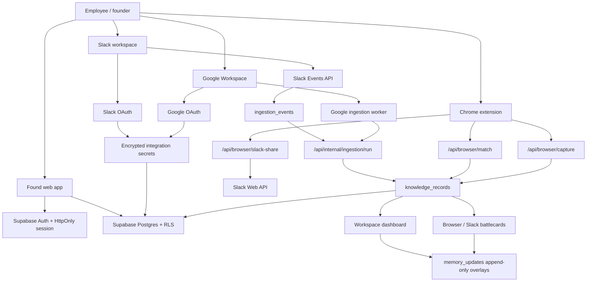

# Found developer handoff

This document is the practical handoff for the next developer taking over Found. It captures the product intent, current implementation, live surfaces, known gaps, and the behavior rules that came from user testing.

## Product intent

Found is an organisational-memory platform. A company signs in, connects Slack and Google Workspace, and Found builds a centralized memory layer from source-linked evidence. The important product promise is not “search all docs.” The promise is:

> While people work in Slack, Google Docs, Sheets, browser articles, and later Jira/Notion/GitHub, Found quietly checks whether the current idea has already been discussed, decided, implemented, rejected, or updated elsewhere.

If there is a strong match, Found surfaces a battlecard with the latest company context and source receipts. If there is no strong match, Found should stay out of the way but let the user save the current page/link into company memory.

The product must feel enterprise-grade: calm, source-backed, permission-aware, and low-noise. False positives are worse than missed weak matches.

## Live project

- Production URL: `https://sage-profiterole-3b1c22.netlify.app`
- Main dashboard: `https://sage-profiterole-3b1c22.netlify.app/workspace`
- Integrations: `https://sage-profiterole-3b1c22.netlify.app/integrations`
- Extension package: `https://sage-profiterole-3b1c22.netlify.app/found-extension-v0.5.8.zip`
- Repository: `https://github.com/Pratiksha935/Echo`
- Hosting: Netlify connected to `main`
- Primary stack: Next.js App Router, TypeScript, Supabase, Netlify, Chrome MV3 extension, Slack OAuth/Events/Interactivity, Google OAuth/Drive APIs.

## Main product surfaces

1. Landing page
   - Explains the company-memory concept.
   - Should route authenticated users into the workspace.

2. Login
   - Supports Supabase-backed auth flows.
   - Password login exists because magic-link delivery was rate-limited/unreliable during demo testing.
   - Future target: smooth Google sign-in as the primary entry point.

3. Integrations
   - Shows setup progress.
   - Current priority providers: Google Workspace and Slack.
   - Notion, Jira, GitHub, Read AI are planned/secondary.
   - Important: Google/Slack consent must be explicit. A user logging in with email is not the same as authorizing Drive or Slack content.

4. Workspace dashboard
   - Centralized company-memory view.
   - Should become the main executive/product dashboard, not raw data dump.
   - Current desired shape:
     - Overview: what is trending now in the company.
     - Department tabs: Product, GTM, Sales, Engineering, Research.
     - Knowledge graph: decision clusters, source receipts, conflicts, and updates.
     - Memory timelines: newest-first updates per decision.
     - No raw overload on the overview.

5. Decision timeline
   - Shows one memory cluster and its source receipts.
   - Original source records remain untouched.
   - User feedback and Slack updates are append-only overlays.
   - Important fix in this handoff branch: browser-saved records now redirect to `/workspace` instead of fragile `/workspace/decision/browser:<uuid>` URLs that 404.

6. Browser extension
   - Chrome MV3 companion.
   - Always-on avatar appears on pages.
   - Battlecard opens automatically only when a strong match exists.
   - When no strong match exists, avatar remains available so user can save the URL/comment/department to Found.
   - Extension must not rely on users clicking “check page” as the primary workflow.

7. Slack app
   - Slack web can be inspected by the browser extension.
   - Slack desktop app cannot be controlled by a Chrome extension.
   - Slack desktop/product surface should use native Slack App features:
     - message shortcut,
     - private modal battlecard,
     - App Home,
     - optional ephemeral prompts only when user explicitly invokes Found.
   - Do not publicly reply in channels for routine scans.

## Current architecture



## Data model

Key tables:

- `organisations`
- `memberships`
- `integration_connections`
- `integration_secrets`
- `knowledge_records`
- `memory_updates`
- `ingestion_events`
- `integration_sync_runs`

Conceptually:

- `knowledge_records` are source-backed facts or documents.
- `memory_updates` are user/team overlays. They never overwrite source truth.
- `integration_connections` represent OAuth connections per organisation/provider.
- `integration_secrets` store encrypted provider tokens.
- `ingestion_events` make Slack ingestion durable and retryable.

## Important behavior rules

### Closed-world knowledge

Found should answer and warn only from indexed company knowledge. It should not invent generic product advice. If evidence is insufficient, the correct answer is concise: not enough company evidence found.

### Conservative matching

Only show a battlecard when the match is strong:

- exact same intervention/outcome, or
- same underlying idea expressed differently.

Do not show battlecards for:

- tangential topics,
- generic AI/company/research pages,
- broad term overlap,
- shopping/catalogue queries,
- casual Slack messages.

Examples from testing:

- A Harness Engineering article should not match a rental deposit decision.
- Anthropic homepage/research pages should not match rental deposit decisions.
- “Let’s go for lunch” should produce no Slack response.
- “red saree under ₹2,000” is a catalogue query, not company knowledge.
- “virtual try-on” is tangential to backup-size reservation, not a duplicate.

### Browser extension UX

Desired extension behavior:

1. Avatar is always visible.
2. If a strong match exists, battlecard opens automatically.
3. If no match exists, no battlecard opens.
4. Clicking the avatar with no match opens a save panel:
   - department picker,
   - comment field,
   - add to memory,
   - optional send-to-Slack.
5. After saving, do not recolor the entire panel green.
6. “Open saved record” should route to the dashboard, not a broken record URL.
7. If the user was redirected from Found to Slack/Docs, suppress immediate reverse battlecard loops.
8. The extension should not scan its own injected overlay text.

### Slack UX

Slack must be low-noise.

For Slack app/native workflow:

- Do not publicly reply to every message.
- Do not show infrastructure/model errors in Slack.
- For Slack desktop users, use message shortcuts and private modals.
- The battlecard should be private unless the user explicitly shares it.
- Future App Home should show:
  - recent prior-work detections,
  - saved links,
  - pending memory review,
  - integration status.

For Slack web:

- The browser extension should inspect only the newest visible human message, not the whole channel.
- It should ignore Slack UI chrome, date separators, “view thread,” notifications banners, and message composer text.

### Save/share from browser

Users should be able to save any article/page into Found with:

- URL,
- page title,
- page excerpt,
- department,
- comment,
- user identity,
- timestamp.

They should also be able to send that page to Slack teammates or channels, but only after selecting recipients. Slack destination lists depend on the connected Slack token and app scopes. If targets fail to load, the UI must explain whether the browser is not paired or Slack must be reconnected.

## Known current gaps

These are not solved fully yet:

1. Matching quality needs a real semantic/Hermes layer.
   - Current system has deterministic guards and heuristics.
   - Desired: Hermes evaluates high-level intent, confidence, conflict, and source-backed reasoning.
   - Must still be closed-world and conservative.

2. Slack desktop battlecards are not the same as browser extension battlecards.
   - Chrome extension cannot run inside the Slack desktop app.
   - Need native Slack surfaces: message shortcuts, modals, App Home.

3. Slack users/channels dropdown depends on Slack OAuth scopes and token health.
   - If Slack targets do not load, reconnect Slack.
   - Channels may require the app to be invited and scopes to include channel read/write needs.

4. Dashboard is not yet enterprise-grade enough.
   - Needs cleaner information architecture.
   - Overview should summarize trends, conflicts, recent decisions, and departments.
   - Detail pages should show chronological evidence timelines and knowledge graph links.

5. Google Workspace ingestion is currently document-focused.
   - Future should include Sheets and richer Drive metadata.
   - Permission mapping needs to stay strict.

6. Browser extension distribution is still manual zip.
   - Production target is Chrome Web Store with auto-updates.

## Hermes role — desired end state

Hermes should become the intelligence and continual-learning layer, not just an external chatbot.

Desired responsibilities:

- classify intent from Slack, Docs, Sheets, web pages, Jira, Notion, GitHub;
- decide whether a battlecard should surface;
- explain why two pieces of work match or do not match;
- learn from corrections and append-only memory updates;
- watch decision patterns over time;
- power a conversational bot inside the centralized platform;
- summarize “what changed this week” by department;
- detect stale/conflicting decisions;
- recommend owners/sources to review;
- preserve source receipts and avoid hallucinating.

Guardrail: Hermes should never overwrite original source content. It appends memory/update layers in Found only.

## Recommended next implementation order

1. Finish saved-memory redirect fix.
   - New browser captures return `/workspace`.
   - Unknown decision detail URLs redirect to `/workspace` instead of 404.

2. Replace matching with a proper evidence scorer.
   - Keep fast deterministic negative controls.
   - Use Hermes/LLM only after candidates pass source/term/entity gates.
   - Require source-backed explanation before auto-opening a battlecard.

3. Rebuild workspace dashboard IA.
   - Overview: company pulse.
   - Departments: Product, GTM, Sales, Engineering, Research.
   - Decision graph: nodes are memory clusters, edges are shared sources/owners/conflicts.
   - Timeline: newest-first evidence and updates.

4. Build Slack App Home + shortcut flow.
   - Message shortcut opens private battlecard modal.
   - App Home lists recent detections and setup status.
   - No public channel replies except explicit share actions.

5. Improve browser extension UX.
   - Keep avatar small and persistent.
   - Improve save panel layout.
   - Make send-to-Slack target picker searchable.
   - Add visible “saved to workspace” state without green flood.

6. Chrome Web Store packaging.
   - Replace manual zip installation.
   - Add versioned update flow.

7. Production security completion.
   - Disconnect/revocation flows.
   - Token refresh.
   - Audit logs.
   - Retention/deletion policies.
   - Private channel ACL sync before private Slack ingestion.

## Developer notes from user feedback

- Do not make this “demo-only.” Build toward real users connecting real workspaces.
- Do not hardcode data for matching. Seed data is acceptable for testing, but production matching must use indexed records.
- Do not show raw logs, model retries, or infrastructure status in Slack.
- The UI must feel calm and enterprise-grade, not loud, toy-like, or overcolored.
- The battlecard should be useful because it is source-linked and latest, not because it is visually dramatic.
- The dashboard should answer: “What does the company know right now?” not “Here is every raw row.”
- The browser extension should support two modes:
  - strong match: surface insight automatically;
  - no match: let the user save/share the current URL.
- Slack app support is a moat because many users live in Slack desktop.

## Validation expectations before handoff

Run at least:

```bash
npm run typecheck
npm run lint
node --test tests/extension-battle-card.test.mjs tests/production-browser-route.e2e.test.mjs tests/security-boundaries.test.mjs
npm run build:netlify
```

For live smoke testing:

1. Login.
2. Open `/integrations`.
3. Connect Google Workspace.
4. Connect Slack.
5. Install latest extension.
6. Pair browser.
7. Open a known indexed Google Doc and confirm battlecard surfaces only if match is strong.
8. Open an unrelated article and confirm no false battlecard.
9. Save the unrelated article to Found and confirm redirect goes to `/workspace`.
10. Reopen dashboard and confirm the saved memory appears in the right department/timeline.

